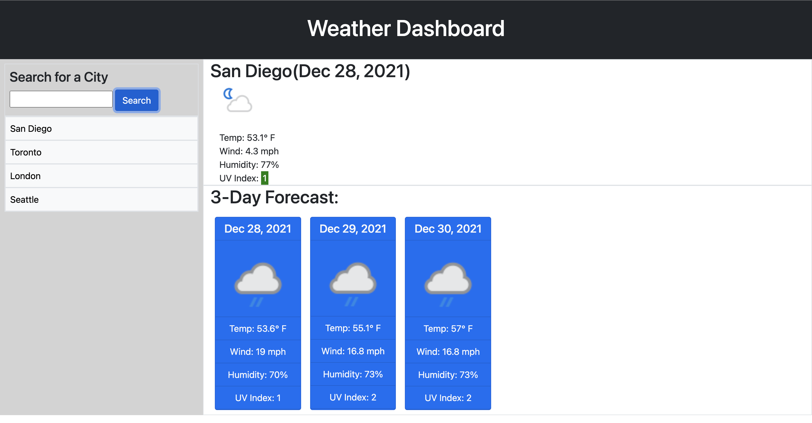

### Name of the Project: Weather Dashboard ###

### Description: ###
Weather Dashboard is a simple web application that allows the user to search daily weather forecast.

### Motivation: ###
The motivation behind this project is to learn and demonstrate HTML, CSS, Javascript, Bootstrap and jquery(Third party API's) coding skills.

### Technologies used: ###
    * HTML
    * CSS
    * Visual Studio Code Editor
    * Javascript
    * Bootstrap
    * Jquery
    * Moment.js
    * Third party API's (https://api.weatherapi.com/)
    
### Website Screen Shots: ###

### Website Contents: ###

1. The Header contains Title of the project and current date.
2. The page shows three days weather forecast.
3. Users can look up City based weather forecast using serach option.
4. The weather forcast includes conditions such as Temperature, Wind speed, Humdity and UV Index.
5. This application stores past searches and displays the list of cities.

Live deployed link:

## Username:

https://github.com/sarasuni

## Email:

Sarasuni2021@gmail.com
